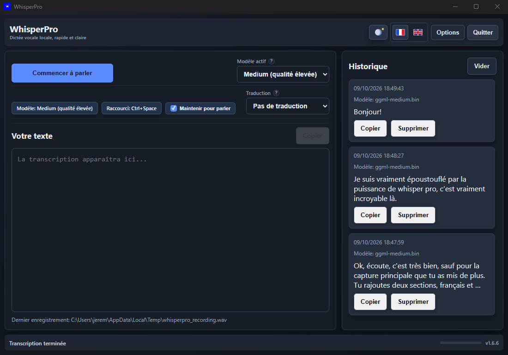
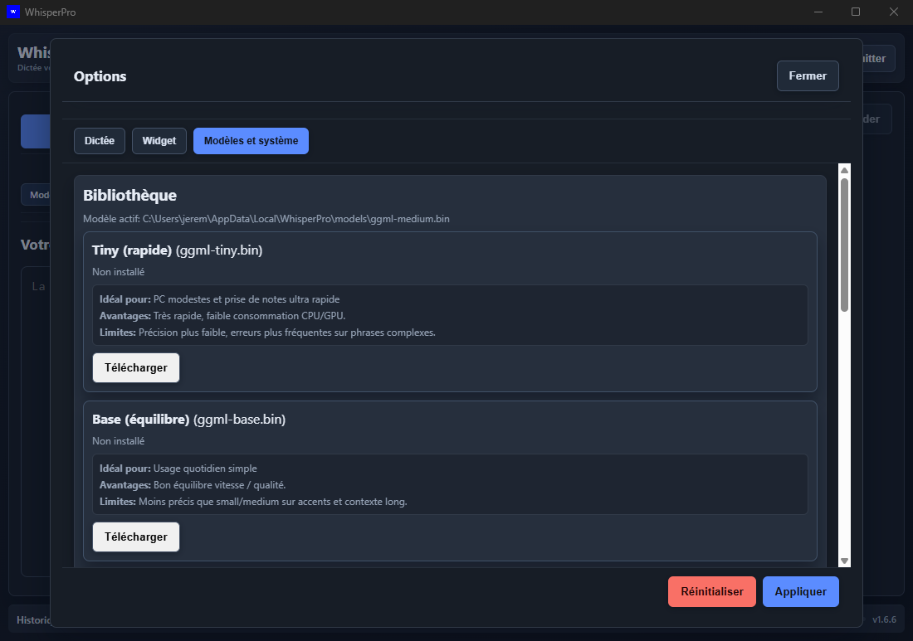
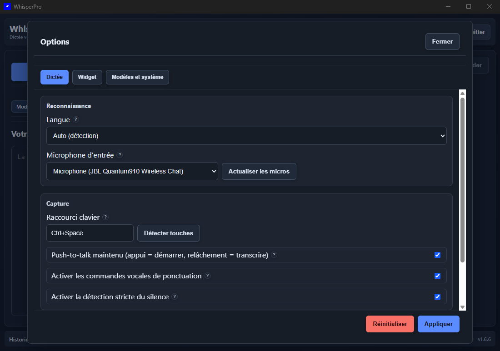

<div align="center">

# WhisperPro

**Local, fast and private voice dictation — on Windows.**

[Français](README.md) · **English**

</div>

**WhisperPro** turns your voice into text, in any application. One global keyboard shortcut, you speak, the text lands wherever your cursor is. Everything runs **locally, on your machine**: no audio ever leaves your PC.

## 🖥️ The interface



## ✨ Features

- **Instant dictation** — global `Ctrl+Space` shortcut (customizable), or push-to-talk: hold to speak, release to transcribe
- **100 % local** — Whisper runs on your machine with GPU acceleration when available; the app detects and repairs its own acceleration setup
- **Direct text injection** into the active field: mail clients, editors, chats, code editors…
- **Automatic translation** after transcription, into multiple target languages
- **Voice punctuation** — say "period", "comma", "new paragraph"
- **Floating mini-widget** with recording feedback and live mic level
- **Transcription history** with quick copy, or **Secure Text Mode** with zero local storage
- **Built-in model library** — tiny to medium, download / activate / remove from the app
- **Light and dark themes**, UI in French or English
- **One-click updates** from the footer

## 🎯 Use cases

Faster emails and messages · real-time meeting notes · dictating first drafts · speak-and-translate in seconds.

## ⚙️ Installation

> **Prerequisite: [Node.js](https://nodejs.org) must be installed** (LTS recommended). This is required — without Node.js, WhisperPro cannot be installed or launched.

Distributed as an npm package (no installer, no SmartScreen prompts):

```bash
npm install -g whisperpro
whisperpro
```

Requires Node.js. Updates: in-app button, or `npm install -g whisperpro@latest`.

## 🔧 Configuration

- **Models**: tiny (fast) → medium (high quality), managed from the *Models & system* tab



- **Options**: language, microphone, keyboard shortcut, voice punctuation, widget



## ☕ Support

[Buy Me a Coffee — skroproduction](https://buymeacoffee.com/skroproduction)
